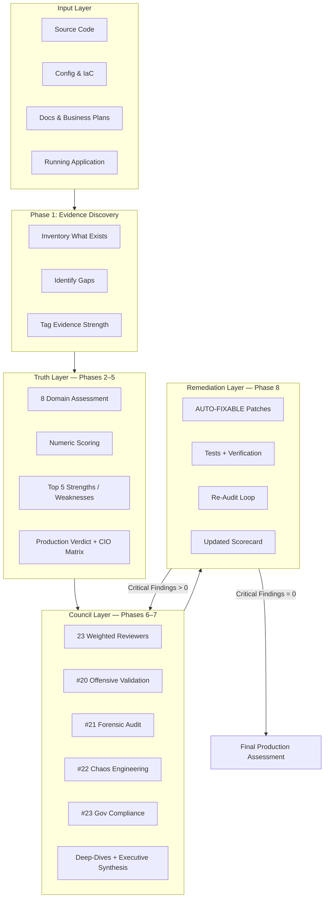

# Executive Council Review

A **Cursor Agent Skill** that runs a boardroom-grade Executive Review Council on any project — source code, web apps, SaaS, government systems, enterprise software, AI projects, architecture documents, or business plans.

> **The goal is truth, not criticism.** Praise what deserves praise. Flag what deserves flags. Never invent findings.

---

## Table of Contents

- [Overview](#overview)
- [Architecture Design](#architecture-design)
- [Use Cases](#use-cases)
- [Quick Start](#quick-start)
- [How It Works](#how-it-works)
- [The 23-Member Council](#the-23-member-council)
- [Report Output](#report-output)
- [Non-Negotiable Rules](#non-negotiable-rules)
- [Repository Structure](#repository-structure)
- [Contributing](#contributing)
- [Developer](#developer)

---

## Overview

Executive Council Review simulates a **formal executive audit board** inside Cursor. Instead of a single generic code review, it produces:

1. An **evidence-based truth report** across 8 technical and business domains
2. Independent opinions from **23 weighted expert reviewers**
3. **Offensive validation**, **forensic audit**, **chaos engineering**, and **government compliance** assessments
4. **Autonomous Remediation Mode** — patches, tests, and re-audit loops for fixable findings

The skill is designed for teams, ministries, enterprises, and investors who need honest, structured, board-ready evaluation — not checklist theater.

### What You Can Review

| Target Type | Examples |
|-------------|----------|
| **Applications** | Web apps, mobile backends, SaaS, internal portals |
| **Government systems** | Ministry workflows, citizen services, org-hierarchy apps |
| **Enterprise software** | ERP modules, HR systems, AD-integrated platforms |
| **AI projects** | LLM apps, RAG pipelines, agent frameworks |
| **Documentation** | Architecture docs, ERDs, API specs, business plans |
| **Infrastructure** | CI/CD, IaC, deployment configs (when provided) |

### Supported Languages

Reports match the user's language:

- **English input → English report**
- **Arabic input → Arabic report**

---

## Architecture Design

The skill is built as a **three-layer assessment pipeline** with an **eight-phase workflow**. Each layer serves a different audience and decision type.

### System Architecture (High Level)



### Three Report Layers

| Layer | Purpose | Primary Audience |
|-------|---------|------------------|
| **Truth Layer** | Evidence, 8 domains, scores, top strengths/weaknesses, verdict | Executives asking *"Give me the honest truth about my project"* |
| **Council Layer** | 23 weighted reviewers, offensive/forensic/chaos/gov validation, kill test | Formal audits, ministries, investment committees |
| **Remediation Layer** | Phase 8: code patches, tests, re-audit loops | Teams who want audit **and fix** in the same session |

### Eight-Phase Workflow

```
Phase 1  →  Evidence Discovery
Phase 2  →  Domain Assessment (8 domains)
Phase 3  →  Numeric Scoring
Phase 4  →  Top 5 Strengths + Top 5 Weaknesses
Phase 5  →  Production Verdict + CIO Deployment Matrix
Phase 6  →  23-Member Weighted Council
Phase 7  →  Structured Deep-Dives + Executive Synthesis
Phase 8  →  Autonomous Remediation Mode (audit → fix → re-audit)
```

### Eight Assessment Domains (Truth Layer)

Each domain is scored independently using **domain decoupling** — weak security does not automatically slash Architecture or Business Value unless evidence supports it.

| # | Domain | Key Focus |
|---|--------|-----------|
| 1 | **Architecture** | Clean Architecture, SOLID, coupling, maintainability |
| 2 | **Security** | AuthN/Z, OWASP, secrets, encryption |
| 3 | **Database** | Schema, indexes, EF/SQL, N+1, backup evidence |
| 4 | **Operations** | CI/CD, monitoring, DR, incident response |
| 5 | **Product** | UX signals in code, feature completeness |
| 6 | **Government Readiness** | Audit logs, org hierarchy, policy, SLA |
| 7 | **Financial / Business** | Viability, execution risk, value drivers |
| 8 | **Scalability & Performance** | Load paths, SignalR, concurrency, user tiers |

### Evidence Classification Model

Every finding is tagged with evidence strength:

| Label | Meaning |
|-------|---------|
| **Strong Evidence** | Direct code, config, test, or document proof |
| **Moderate Evidence** | Reproducible inference from multiple artifacts |
| **Weak Evidence** | Single weak signal — limitation stated explicitly |
| **Unable To Verify** | Gap documented; no guessing |

Security findings use an additional classification:

| Label | Meaning |
|-------|---------|
| **CODE-REVIEW-HYPOTHESIS** | Risk inferred from code; attack not executed |
| **TOOL-DETECTED** | SAST/DAST/scanner finding with output |
| **EXPLOIT-CONFIRMED** | PoC or scanner-confirmed exploitable issue (#20 only) |
| **NOT TESTED** | On checklist but no tool run or code path |

### Critical Reviewer Weighting

Reviewers are **not equal** in synthesis. Weighted scores drive Overall Risk and Production Readiness:

| Weight | Reviewers |
|--------|-----------|
| **1.5x** | Cybersecurity Auditor, Red Team Lead, Pen Tester, Remediation Architect (#19), Offensive Validation (#20), Government Compliance (#23) |
| **1.3x** | Enterprise Architect (#2), SRE (#18), Forensic Auditor (#21), Chaos Engineer (#22) |
| **1.0x** | All other reviewers |

### Deployment Tier Model

The council avoids dramatic "unanimous rejection" language. Instead, it uses **tiered deployment truth**:

| Tier | Typical Gate |
|------|--------------|
| **Production National** | Hard stops cleared, offensive validation complete, governance evidence |
| **Production Enterprise** | Critical Five fixed + security sign-off |
| **Pilot / UAT / POC** | Critical Five fixed; monitoring/DR may follow |
| **Internal Testing** | Dev/QA lab — remediation may be in flight |
| **Do Not Run Anywhere** | Active exploit, no auth at all |

### Hard Stop Rules

These **block immediate production deployment** when verified:

- Critical exploitable security vulnerability
- Missing backup strategy
- Missing authentication controls
- No disaster recovery plan
- Unencrypted sensitive data (where encryption is required)

After **Critical Five** remediation, Pilot/UAT tiers may become **Conditional ✅** — not blanket rejection.

### Remediation Architecture (Phase 8)

Findings are classified into two remediation paths:

```
┌─────────────────────────────┬──────────────────────────────────────┐
│ AUTO-FIXABLE                │ EXTERNAL-INFRASTRUCTURE-REQUIRED     │
├─────────────────────────────┼──────────────────────────────────────┤
│ Auth/validation gaps        │ Firewall / WAF                       │
│ Hardcoded secrets           │ SIEM / AD policies                   │
│ Missing health checks       │ DR environments                      │
│ Missing CI/CD / tests       │ Network segmentation                 │
│ RBAC weaknesses             │ Production certificates              │
│ Dependency vulnerabilities  │ Hardware capacity                    │
└─────────────────────────────┴──────────────────────────────────────┘
```

**AUTO-FIXABLE** items are remediated in-repo with patches, tests, and verification steps. The council loops until **Critical Findings = 0** (or only external items remain documented).

---

## Use Cases

### 1. Pre-Production Security & Readiness Audit

**Scenario:** A ministry IT team is preparing a citizen portal for national deployment.

**How the skill helps:**
- Phase 1 inventories auth, audit logs, and deployment configs
- Security and Government Readiness domains surface verified gaps
- Reviewer #23 maps policy/governance controls vs ministry requirements
- Reviewer #20 runs DAST/SAST when the app is runnable
- Phase 5 delivers a CIO Deployment Matrix (National / Pilot / UAT / Internal)
- Phase 8 auto-fixes validation, logging, and CI gaps in the repository

**Trigger phrases:** *"Is this production-ready?"*, *"Government deployment review"*, *"What would a CIO think?"*

---

### 2. Red Team & Offensive Validation

**Scenario:** A security team suspects IDOR or privilege escalation but needs evidence, not hypotheses.

**How the skill helps:**
- Red Team (#6) and Pen Tester (#17) produce **CODE-REVIEW-HYPOTHESIS** attack paths
- Offensive Validation (#20) validates with OWASP ZAP, Nuclei, Burp, dependency scans
- Red Team Checklist Matrix marks each vector: NOT TESTED | HYPOTHESIS | TOOL-DETECTED | EXPLOIT-CONFIRMED
- Real Risk Score replaces guesswork with tool output or explicit gaps

**Trigger phrases:** *"Red team this"*, *"Run DAST"*, *"Offensive validation"*, *"Security review"*

---

### 3. Enterprise Architecture Review

**Scenario:** A CTO wants an honest assessment of Clean Architecture, RBAC design, and technical debt before a major release.

**How the skill helps:**
- Enterprise Architect (#2) and Principal Software Architect (#4) evaluate layer boundaries and SOLID compliance
- Architecture domain is scored **independently** from Security (domain decoupling)
- Strengths are documented with file paths — not ignored when security is weak
- Top 30 improvements are prioritized by risk reduction and effort

**Trigger phrases:** *"Review my architecture"*, *"Audit this codebase"*, *"Technical debt assessment"*

---

### 4. Chaos Engineering & Resilience Testing

**Scenario:** An SRE needs proof of failover behavior before signing off on 99.9% SLA claims.

**How the skill helps:**
- SRE (#18) evaluates RTO/RPO documentation and monitoring coverage
- Chaos Engineer (#22) injects failures when the environment allows: DB down, process kill, SignalR storm
- Each scenario is marked NOT TESTED | SIMULATED | CHAOS-CONFIRMED
- Resilience Score and measured RTO/RPO appear in the report — or **Unable To Verify**

**Trigger phrases:** *"Chaos test this"*, *"DR review"*, *"Resilience assessment"*

---

### 5. Investment & Board Due Diligence

**Scenario:** An investor or board member evaluates a startup's technical execution before funding.

**How the skill helps:**
- Investor & VC Reviewer (#15) assesses product viability and execution risk
- Brutal Reviewer (#16) challenges weak assumptions (cannot approve by design)
- Business Value domain scores feature evidence in code, not production approval
- Executive Kill Test: all 23 reviewers answer *"Would you sign the production approval document?"*
- Investment block with **Would you write the check today?** YES / NO / CONDITIONAL

**Trigger phrases:** *"Executive evaluation"*, *"Due diligence"*, *"Board review"*

---

### 6. Audit-and-Fix in One Session

**Scenario:** A development team receives an audit report every quarter but never gets actionable patches.

**How the skill helps:**
- Principal Remediation Architect (#19, 1.5x weight) leads Phase 8
- Every verified finding includes: Root Cause, Fix Strategy, Code Patch, Verification Steps, Risk Reduction Estimate
- AUTO-FIXABLE items are implemented directly in the repo
- Second full audit runs automatically; loop continues until Critical Findings = 0
- Updated Executive Scorecard reflects post-remediation readiness

**Trigger phrases:** *"Audit and fix"*, *"Fix findings"*, *"Remediate critical issues"*

---

### 7. Forensic & Compliance Readiness

**Scenario:** A government auditor asks whether the system can support post-incident investigation.

**How the skill helps:**
- Forensic Auditor (#21) scores audit log completeness, tamper resistance, evidence chain
- Compliance Officer (#10) and Former Government Auditor (#11) cover regulatory and formal audit angles
- Government Compliance Officer (#23) maps national/ministry policy controls separately
- Forensic Readiness Score and Investigation Blockers are explicit outputs

**Trigger phrases:** *"Forensic audit readiness"*, *"Compliance review"*, *"Audit trail assessment"*

---

### 8. Arabic-Language Government Reviews

**Scenario:** A Gulf or MENA ministry team conducts reviews in Arabic with bilingual technical artifacts.

**How the skill helps:**
- Full report output in Arabic when the user writes in Arabic
- Government Digital Transformation Expert (#1) evaluates ministry workflow fit
- Deployment tiers and CIO matrix use standard Arabic executive terminology
- Evidence gaps marked as `غير قابل للتحقق — [ما الذي يغيب]`

**Trigger phrases:** *"راجع المشروع"*, *"تدقيق أمني"*, *"هل المشروع جاهز للإنتاج؟"*

---

## Quick Start

### Installation (Cursor Agent Skill)

1. **Clone this repository:**

   ```bash
   git clone https://github.com/zado-os/executive-council-review.git
   ```

2. **Install as a Cursor skill** — copy or symlink into your Cursor skills directory:

   ```bash
   # User-level skills (recommended)
   cp -r executive-council-review ~/.cursor/skills/executive-council-review

   # Or project-level skills
   cp -r executive-council-review .cursor/skills/executive-council-review
   ```

3. **Restart Cursor** or open a new Agent session so the skill is discovered.

### Usage

In Cursor Agent chat, describe what you want reviewed. The skill activates automatically when your request matches audit, security, or executive evaluation intent.

**Example prompts:**

```
Review my project for production readiness
```

```
Run a full executive council audit on this ASP.NET app — include red team and government compliance
```

```
Audit this repo and fix all AUTO-FIXABLE critical findings
```

```
راجع المشروع من ناحية الجاهزية الحكومية والأمن
```

### What to Provide for Best Results

| Artifact | Why It Matters |
|----------|----------------|
| Full repository or workspace | Phase 1 evidence inventory |
| Running app URL / local instance | Enables #20 DAST and #22 chaos tests |
| Architecture docs / ERDs | Architecture and Database domain scoring |
| CI/CD and deployment configs | Operations and Hard Stop evaluation |
| Business requirements / plans | Product and Business Value domains |

---

## How It Works

### Step-by-Step Flow

1. **Evidence Discovery** — The agent reads code, configs, docs, tests, and IaC. It lists what exists, what is missing, and what cannot be verified.

2. **Executive Scorecard** — Placed at the top of the report after Phase 1:
   ```
   Overall Risk: Low / Medium / High / Critical
   Production Readiness: XX%
   Government Readiness: XX%
   Security Confidence: XX%
   ```

3. **Domain Assessment & Scoring** — Eight domains scored 0–100 with Critical Five blockers separated from Important Improvements.

4. **Production Verdict** — CIO, Security Team, Investor, and deploy-tomorrow decisions with a tiered deployment matrix.

5. **23-Member Council** — Each reviewer produces an independent assessment using the standard template in [reference.md](reference.md).

6. **Deep-Dives & Synthesis** — OWASP mapping, architecture/DB/ops reviews, top 10 risks, top 30 improvements, executive kill test.

7. **Autonomous Remediation** — AUTO-FIXABLE findings patched in-repo; re-audit until critical count reaches zero.

### Final Report Order

1. Executive Summary (5–8 sentences)
2. Executive Scorecard
3. Phases 1–5 (Truth Layer)
4. Phases 6–7 (Council Layer)
5. Phase 8 (Remediation artifacts, re-audit, updated scores)
6. Code citations and patches for critical findings

---

## The 23-Member Council

| # | Role | Weight |
|---|------|--------|
| 1 | Government Digital Transformation Expert | 1.0x |
| 2 | Enterprise Architect | 1.3x |
| 3 | CTO | 1.0x |
| 4 | Principal Software Architect | 1.0x |
| 5 | Cybersecurity Auditor | 1.5x |
| 6 | Red Team Lead | 1.5x |
| 7 | National Cybersecurity Assessor | 1.0x |
| 8 | DevOps & Cloud Architect | 1.0x |
| 9 | Database Architect | 1.0x |
| 10 | Compliance & Governance Officer | 1.0x |
| 11 | Former Government Auditor | 1.0x |
| 12 | QA Director | 1.0x |
| 13 | Performance Engineer | 1.0x |
| 14 | Product Manager | 1.0x |
| 15 | Investor & VC Reviewer | 1.0x |
| 16 | Brutal Reviewer | 1.0x |
| 17 | Principal Penetration Tester | 1.5x |
| 18 | Site Reliability Engineer (SRE) | 1.3x |
| 19 | Principal Remediation Architect | 1.5x |
| 20 | Offensive Validation Reviewer | 1.5x |
| 21 | Forensic Auditor | 1.3x |
| 22 | Chaos Engineer | 1.3x |
| 23 | Government Compliance Officer | 1.5x |

Full role descriptions, templates, and scoring rules: **[reference.md](reference.md)**

Workflow and phase instructions: **[SKILL.md](SKILL.md)**

---

## Report Output

### Sample Executive Scorecard

```
Overall Risk: High
Production Readiness: 42%
Government Readiness: 35%
Security Confidence: 28%
```

### Sample Domain Scores

```
Security ............ 32/100
Architecture ........ 74/100
Database ............ 61/100
Operations .......... 38/100
Scalability ......... 55/100
Maintainability ..... 68/100
Government Ready .... 40/100
Business Value ...... 63/100

Overall Score ....... 52/100
```

### Sample Production Verdict

```
Production Ready (full national): NO
Confidence: 42%
Risk Level: High

Would a CIO approve?             CONDITIONAL — after Critical Five remediation
Would a Security Team approve?   NO — verified auth gaps remain
Would an Investor approve?       CONDITIONAL — strong product, weak ops
Would I deploy tomorrow?         NO — hard stops active
```

---

## Non-Negotiable Rules

| Rule | Requirement |
|------|-------------|
| No false positives | Never mark a vulnerability without direct evidence |
| Separate risk types | Potential Risks ≠ Verified Vulnerabilities |
| Hard stops | Critical vuln, no backup, no auth, no DR, unencrypted sensitive data → no immediate deploy |
| Offensive proof | No exploit confirmed without #20 tool run or PoC |
| Chaos proof | No resilience confirmed without #22 test — else NOT TESTED |
| Truth balance | Report at least one validated strength when evidence exists |
| Domain decoupling | Score each domain on its own evidence |
| Complete findings | Every verified finding must include a remediation path |
| Phase 8 mandatory | AUTO-FIXABLE items must be remediated in-repo |

---

## Repository Structure

```
executive-council-review/
├── README.md       # This file — overview, architecture, use cases
├── SKILL.md        # Cursor Agent Skill workflow (Phases 1–8)
└── reference.md    # Full reference: 23 reviewers, weighting, templates, rules
```

---

## Contributing

Contributions that improve evidence quality, reviewer templates, or remediation guidance are welcome.

1. Fork the repository
2. Create a feature branch (`git checkout -b feature/improve-reviewer-template`)
3. Commit your changes with a clear message
4. Open a Pull Request describing what changed and why

Please keep changes aligned with the skill philosophy: **truth over theater**, **evidence over inference**, **remediation over reporting alone**.

---

## Developer

**Developed by:** Hussain Alzadjali / Software Development

**Repository:** [https://github.com/zado-os/executive-council-review](https://github.com/zado-os/executive-council-review)
